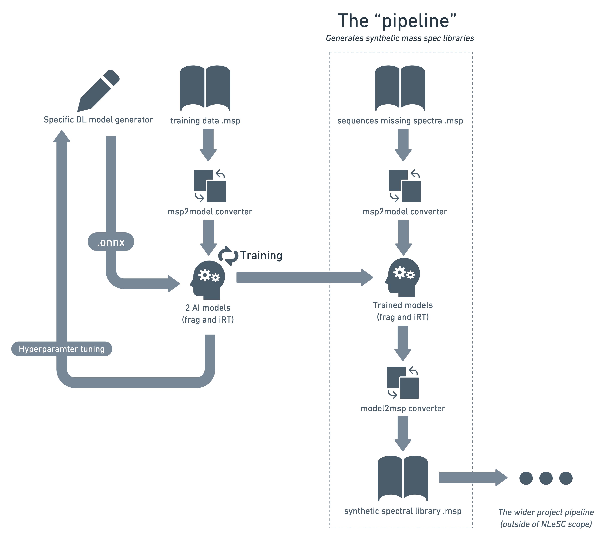

[](https://www.research-software.nl/software/aiproteomics) [](https://badge.fury.io/py/aiproteomics) [](https://fair-software.eu) [](https://github.com/aiproteomics/aiproteomics/actions/workflows/build.yml) [](https://github.com/aiproteomics/aiproteomics/actions/workflows/cffconvert.yml) [](https://github.com/aiproteomics/aiproteomics/actions/workflows/markdown-link-check.yml)  [](https://doi.org/10.5281/zenodo.7890716)

## `aiproteomics` python package
This package contains various tools, datasets and ML model implementations from the field of (phospho-)proteomics. It is intended to facilitate the testing and comparison of different neural network architectures and existing models, using the same datasets. Both retention time and fragmentation (MSMS) models are included.

Implementations of existing models from the literature are intended to be modifiable/extendable. For example, so that tests may be carried out with different peptide input lengths etc.

## Installation instructions
### Latest release
The latest release of `aiproteomics` can be installed from the python package index using `pip` as follows:
```
pip install aiproteomics
```

### Latest (development) version
The latest version can be installed using pip after cloning the repository.  

```
git clone git@github.com:aiproteomics/aiproteomics.git
cd aiproteomics/
pip install .
```

## Try demo notebooks
After installation, you can try out the demo notebooks by following the instructions [here](demo/README.md).

## Redesign in progress
This package is in the process of being redesigned to make it more general and portable. The redesign is focussing on the creation of:
1. Generators of models (in the open and portable ONNX format)
2. Converters from .msp format to input for each model type
3. Converters from each model type to .msp

Below is a diagram showing how the proposed tools will be combined to produce a pipeline for training proteomics models and using them to generate synthetic spectral libraries:



## Contributing

If you want to contribute to the development of aiproteomics,
have a look at the [contribution guidelines](CONTRIBUTING.md).
